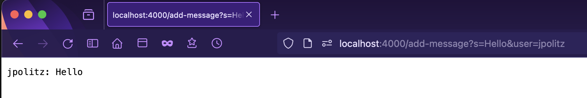
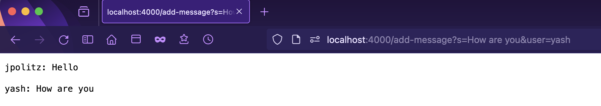
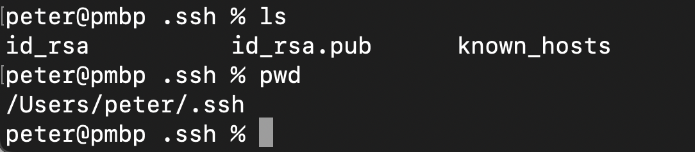
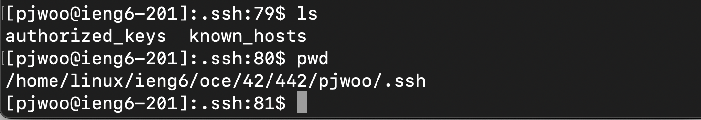
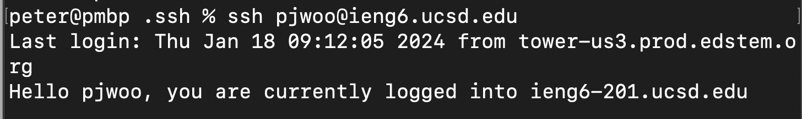

# Lab 2

## Part 1
Code for ChatServer:
```
import java.io.IOException;
import java.net.URI;
import java.io.BufferedWriter;

class ChatHandler implements URLHandler {
    String chat = "";

    // /add-message?s=<MESSAGE>&user=<NAME>
    public String handleRequest(URI url) {
        if (url.getPath().equals("/add-message")) {
            String[] params = url.getQuery().split("&");
            String[] messageArr = params[0].split("=");
            String[] userArr = params[1].split("=");

            if (userArr[0].equals("user") && messageArr[0].equals("s")) {
                String user = userArr[1];
                String message = messageArr[1];
                this.chat += user + ": " + message + "\n\n";
                return this.chat;
            }
        }

        return "Use /add-message?s=<MESSAGE>&user=<NAME>";
    }
}

class ChatServer {
    public static void main(String[] args) throws IOException {
        int port = Integer.parseInt(args[0]);
        Server.start(port, new ChatHandler());
    }
}
```

Below are two screenshots of using `/add-message`:

> The method used in my request is `handleRequest`. The relevant argument is the URL that is passed in and the relevant values are the chat history field of the class `String chat`, the arrays of strings `String[] params`, `String[] messageArr` and `String[] userArr`. The values of the string arrays get changed based on the URL that is passed in. In this case, the URL is now dealing with a query of the message `Hello` from `jpolitz`. The values of `params`, `messageArr` and `userArr` are now changed to hold the query values. Then the `chat` string is updated to include `jpolitz: Hello`


> The method used in my request is the same as above. The relevant arguments are still the same as the URL is being passed in and the relevant values of `chat`, `params`, `messageArr` and `userArr` are still being used. In this case, the URL is now dealing with a query of the message `How are you` from `yash`. The values of `params`, `messageArr` and `userArr` are now changed to hold the query values. The `chat` string previously held `jpolitz: Hello` and the chat line `yash: How are you` is concatenated onto it (with `\n\n` for two newlines to provide some spacing).

---

## Part 2
Private Key path:


Public Key path:


Logging into `ieng6` without being prompted for password:


---

## Part 3
- From week 2, I learned how to create a Java Server. It was interesting to look at the base code for `Server.java` and see how the server functions and what is needed to create one. I also learned how to remotely connect to `ieng6` and how to setup a remote server using the connection. It was really cool to see the number incrementer app work on different devices, locally and remotely, and see it update.
- From week 3, I learned how to setup an SSH key to login wihout being asked for a password. When setting up the SSH key, I learned about `scp` and what the command does. I also learned how to use `man` to look up command manuals in the terminal without having to search it up online.
