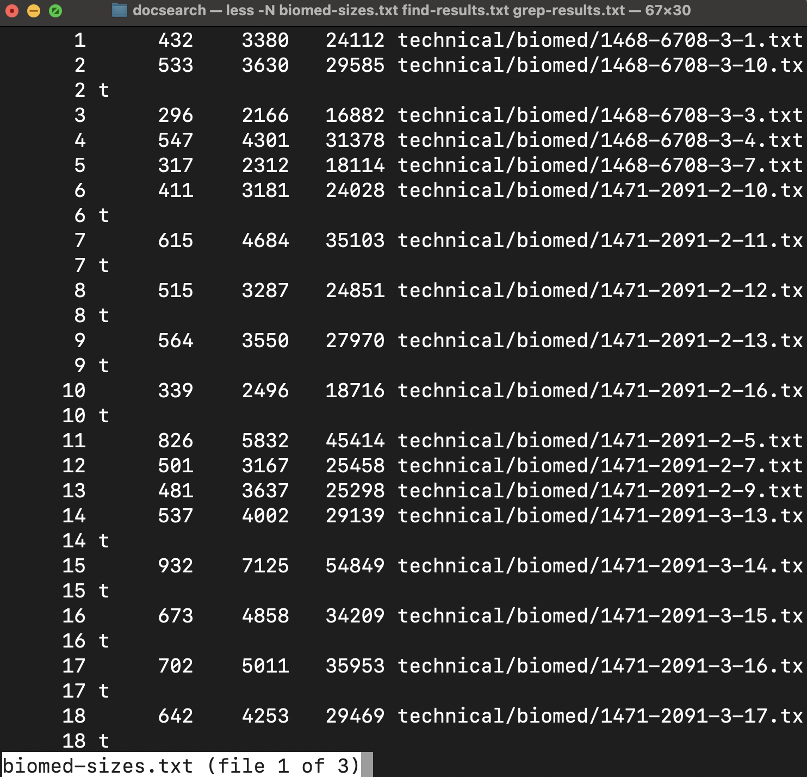

# Lab 3

## Part 1
The bug I chose was the ArrayExamples
- A failure-inducing input for the buggy program, as a JUnit test and any associated code:

Test:
```
@Test 
public void testReverseInPlace2() {
  int[] input1 = { 1, 2, 3, 4 };
  ArrayExamples.reverseInPlace(input1);
  assertArrayEquals(new int[]{ 4, 3, 2, 1 }, input1);
}
```
Associated Code: 
```
static void reverseInPlace(int[] arr) {
  for(int i = 0; i < arr.length; i += 1) {
    arr[i] = arr[arr.length - i - 1];
  }
}
```

- An input that doesn't induce a failure, as a JUnit test and any associated code:

Test:
```
@Test 
public void testReverseInPlace() {
    int[] input1 = { 3 };
    ArrayExamples.reverseInPlace(input1);
    assertArrayEquals(new int[] { 3 }, input1);
}
```
Associated Code: 
```
static void reverseInPlace(int[] arr) {
  for(int i = 0; i < arr.length; i += 1) {
    arr[i] = arr[arr.length - i - 1];
  }
}
```

- The symptom, as the output of running the tests:


- The bug, as the before-and-after code change required to fix it:

Before:
```
static void reverseInPlace(int[] arr) {
  for (int i = 0; i < arr.length; i += 1) {
    arr[i] = arr[arr.length - i - 1];
  }
}
```
After:
```
static void reverseInPlace(int[] arr) {  
  for (int i = 0; i < arr.length / 2; i++) {
    int temp = arr[i];
    arr[i] = arr[arr.length - 1 - i];
    arr[arr.length - 1 - i] = temp;
  }
}
```

This code was buggy because it was not storing the values when swapping them without using any sort of temp storage. Adding a temp int, I was able to fix the bug and reverse the array in place without needing a temp array.

---

## Part 2
I chose to look into the `less` command

1. Search within less using `/` (ChatGPT):

Example 1:
```
less *.txt
/
/technical/biomed/1471-2091
```
> Here I am in `docsearch` and using `less *.txt`. I get a large output showing `490673 3437323 26328271 total`. I then use `/` to start a search within `less` and look for `/technical/biomed/1471-2091`. This then highlights a result of files matching that pattern I was searching for. This can be useful if you cannot remember certain file names, but remember general folder structures. Then you can see what files are there based on the pattern given to the search.


Example 2:
```
less *.txt
/
/technical/plos
```
> Here I am in `docsearch` and using `less *.txt`. I get the same output and am going to search for `/technical/plos`. I am given a notice that the pattern is not found. This is useful to search for specific patterns and see if they are present in the output.


2. Jump to a specific line with `+` (ChatGPT):

Example 1:
```
less +10 technical/biomed/1468-6708-3-1.txt
```
> Here I am going to line 10 in `technical/biomed/1468-6708-3-1.txt`. I am using less to look at the output of this particular file and using the `+10` command to jump to line 10 of the document. This is useful for being able to move quickly through a document and being able to change lines.


Example 2:
```
less +2 *.txt
```
> Here I am moving to line 2 when looking at the output of the search result for `*.txt` within `docsearch`. Line 1 is `432    3380   24112 technical/biomed/1468-6708-3-1.txt`, but I start out in line 2 which is `533    3630   29585 technical/biomed/1468-6708-3-10.txt
`. This is useful for being able to quickly move through the output and going to specific results.


3. Follow the end of a growing file with `+F` (ChatGPT):

Example 1:
```
less +F technical/biomed/1468-6708-3-1.txt 
```
> Here I am looking to watch `technical/biomed/1468-6708-3-1.txt` if there are changes being made to it while viewing using `+F`. Currently, there are no changes, but as you can see from the image, `less` is watching for changes to be made. This could be useful for watching changes to documents happen at that time and monitoring those changes.


Example 2:
```
less +F *.txt  
```
> Here is a similar result, but instead of looking in a specific file for changes, I am looking at the results of `*.txt` using `less` and `+F`. The output shows that `less +F` is "waiting for data". This could be useful for watching changes such as adding and removing specific documents which could change the search results.


4. Display line numbers with `-N` (ChatGPT):

Example 1:
```
less -N *.txt 
```
> Using the `-N` option for `less`, I am able to see the line numbers for the search of `*.txt*`. This is useful to see the line numbers as some outputs become very difficult to see what line you are currently on. This command can be combined with others like `+` to jump to a certain line and see the line number from there.



Example 2:
```
less -N +12 technical/biomed/1468-6708-3-1.txt
```
> Using `-N +12`, I was able to use `less` to search for `technical/biomed/1468-6708-3-1.txt` and get to line 12 without having to scroll there myself. This is useful to be able to move around quickly though a file and see the line numbers.

---

ChatGPT Citation:
Using ChatGPT, I searched for `find 4 interesting command-line options or alternate ways to use less`

I then got an output of


which I used as a starting point for my testing and results.
