# Lab 4

## Log into `ieng6`
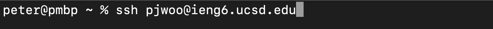
> Use `ssh [username]@ieng6.ucsd.edu` to login to `ieng6`

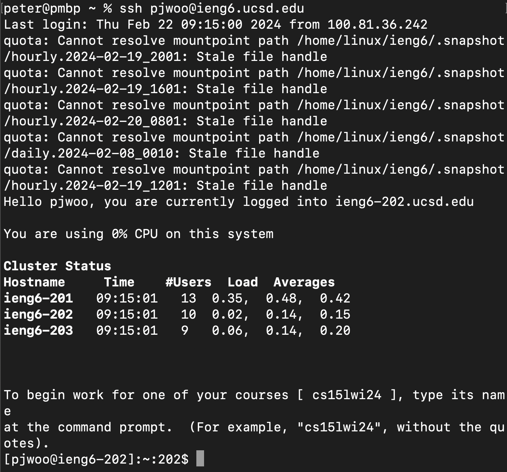

## Clone the repo
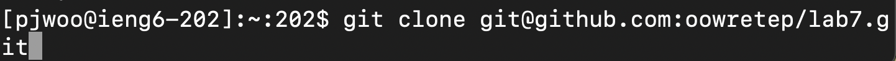
> Use `git clone [repo name]` to clone the repo that we forked

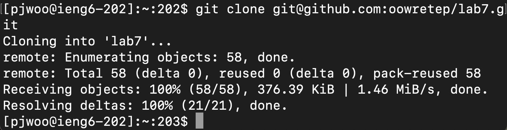

## Run the test
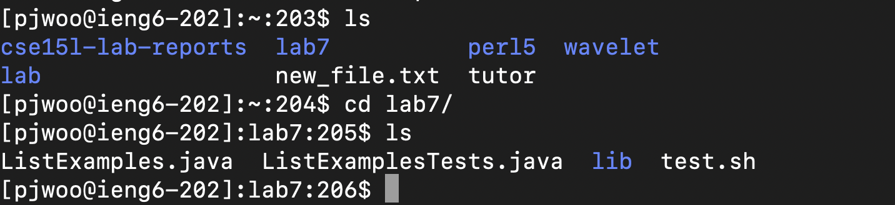
> First we are going to `ls` to see the files in the repo we cloned. Then using the `cd` command, we will move into the `lab7` directory. Then using `ls` again, we can see the `test.sh` script that we can run.

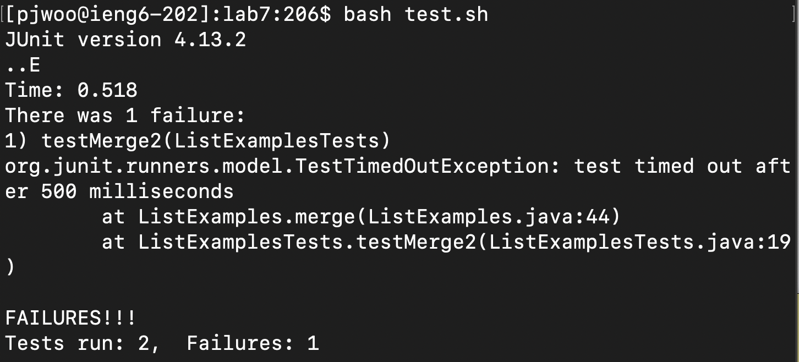
> Running the test using `bash test.sh`, we can see that a test has failed

## Fixing the code

> To fix the code, we will use `vim ListExamples.java` to fix the error

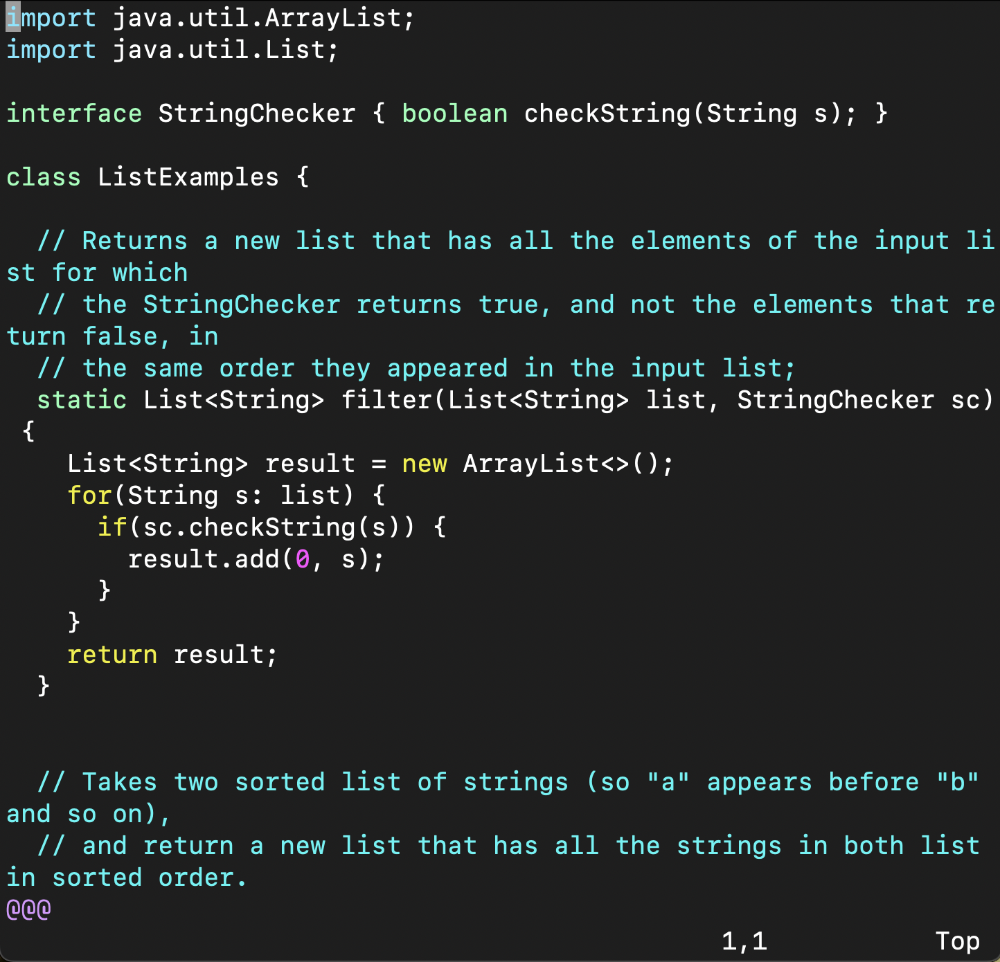
> Here, we have `ListExamples.java` opened and we are at the beginning of the file. We know that the error is at the end of the file, so we can use `<ctrl>+g` to move to the end. Then use `<shift>+g` to move to the end. Then we will use `<h>` 6 times to move to the line that has the error.

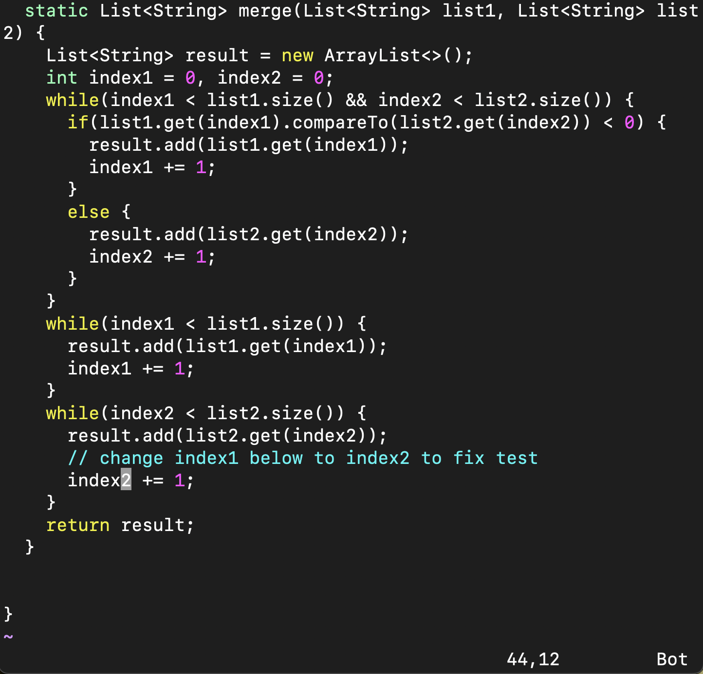
> Then use `<e>` to move to the end of the word (specifically `index1`) and then `<r><2>` to replace the `1` with a `2`.

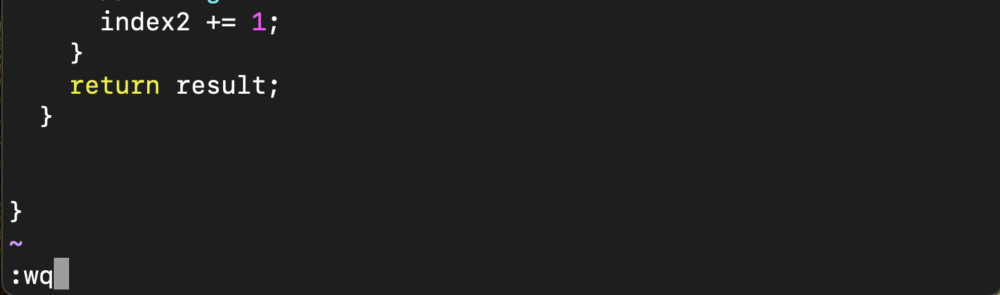
> Now that the line is fixed, we can use `:wq` to save and quit

> Use `<up> twice to get the `bash test.sh` command from bash history and run the test again

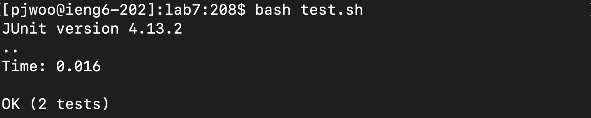
> The test is now successful and our code works so we can now commit and push our changes

## Using git
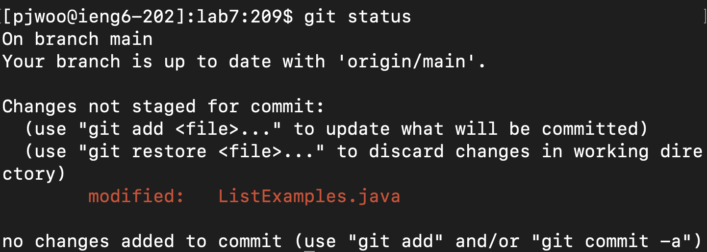
> First, use `git status` to check the status of our branch. We can see that `ListExamples.java` was modified and not staged for commit

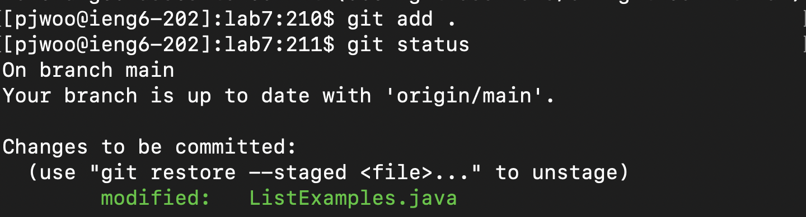
> Use `git add .` to add all changes and then `git status` again to see that changes are ready to be committed

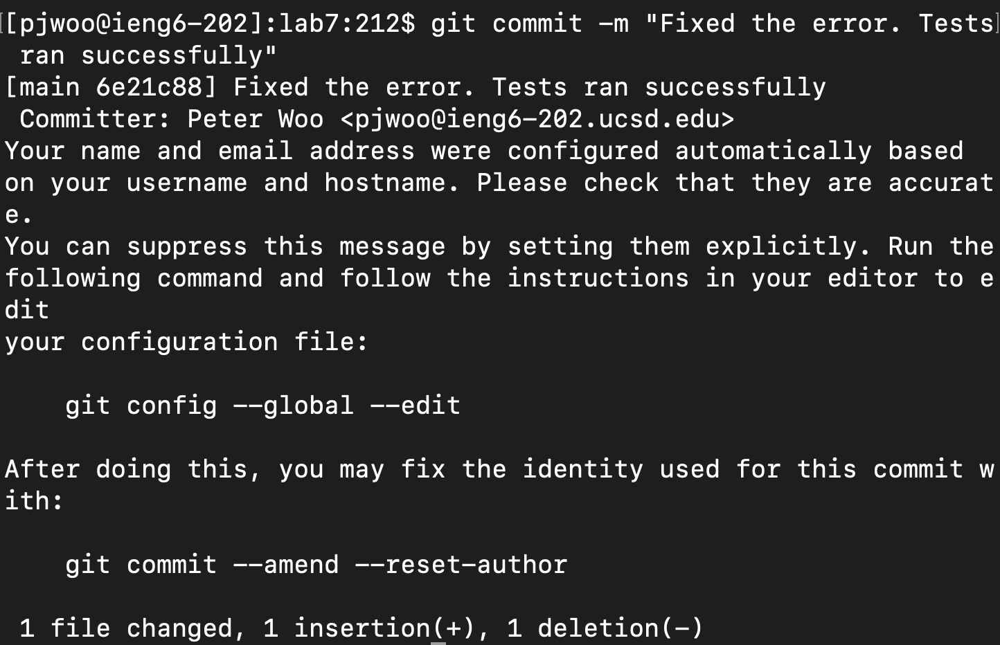
> Use `git commit -m "[MESSAGE]"` to commit our changes and using a message that describes the changes

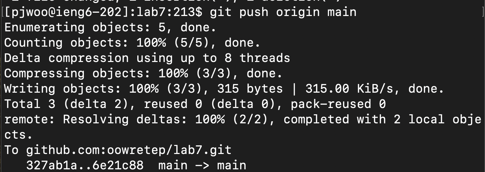
> Now that changes have been committed, we can push to our main branch using `git push origin main`. Here `origin` refers to the repo that we cloned from and `main` is the branch that we want to make changes to
